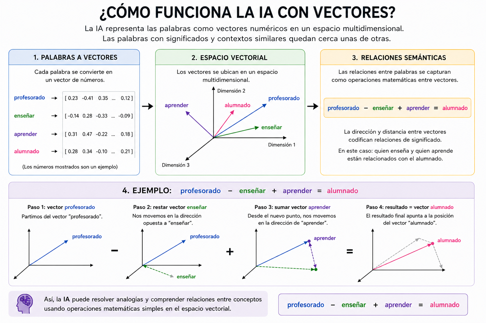

#  CONVERSACIÓN PARA LA CREACIÓN UN GRÁFICO EXPLICATIVO DEL FUNCIONAMIENTO MATEMÁTICO DE LA IA
Grafico en el que se explica como con el uso de la información guardada como vectores la IA puede relacionar conceptos como: profesorado y  alumnado.

---

**🧑 Usuario**
Crea un gráfico que describe el funcionamiento de la IA con vectores. Donde el vector profesorado - el vector enseañar + el vector aprender es igual a alumnado. Con los textos en castellano.

---

**🤖 Asistente de IA - ChatGPT**
<!-- Imagen local -->

---